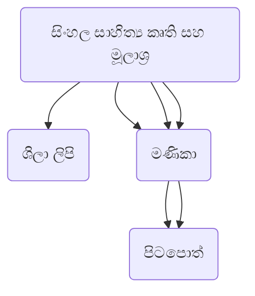

# සිංහල සාහිත්‍ය වංශකතාව

```mermaid
graph TD;
    A(සිංහල සාහිත්‍ය කෘති සහ මූලාශ්‍ර)-->B(ශිලා ලිපි);
    A(සිංහල සාහිත්‍ය කෘති සහ මූලාශ්‍ර)-->C(හෙළ අටුවා);
    A(සිංහල සාහිත්‍ය කෘති සහ මූලාශ්‍ර)-->C(ව්‍යාකපාන);
                         C(ව්‍යාකපාන)-->D(ගැටපද);
                         C(ව්‍යාකපාන)-->D(පිටපොත්);
    A(සිංහල සාහිත්‍ය කෘති සහ මූලාශ්‍ර)-->C(මණිකා);
```
