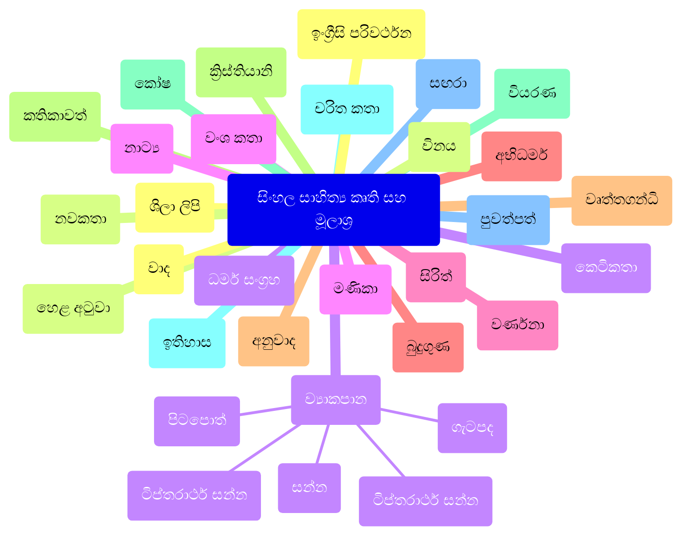

# සිංහල සාහිත්‍ය වංශකතාව


```
stateDiagram
    A(දහම තේරුම් ගැණීම) -->B(ධර්මය මාඝධී භාෂාවෙන් හරියටම කියවා ගැනීම);
    B(ධර්මය මාඝධී භාෂාවෙන් හරියටම කියවා ගැනීම) -->A(දහම තේරුම් ගැණීම);
```


```mermaid
mindmap
    A(සිංහල සාහිත්‍ය කෘති සහ මූලාශ්‍ර)
        B(ශිලා ලිපි)
        C(හෙළ අටුවා)
        D(ව්‍යාකපාන)
            E(ගැටපද)
            F(පිටපොත්)
            H(ටිප්තරාර්ථ සන්න)
            H(ටිප්තරාර්ථ සන්න)
            I(සන්න)
        G(මණිකා)
        J(වර්ණනා)
        K(අභිධර්ම)
        L(වෘත්තගන්ධි)
        M(ක්‍රිස්තියානි)
        N(වියරණ)
        O(චරිත කතා)
        P(පුවත්පත්)
        Q(ඉංග්‍රීසි පරිවර්ථන)
        R(විනය)
        S(ධර්ම සංග්‍රහ)
        T(වංශ කතා)
        U(සිරිත්)
        V(බුදුගුණ)
        W(අනුවාද)
        X(කතිකාවත්)
        Y(කෝෂ)
        Z(ඉතිහාස)
        AA(සඟරා)
        BB(වාද)
        CC(නවකතා)
        DD(කෙටිකතා)
        EE(නාට්‍ය)
```
