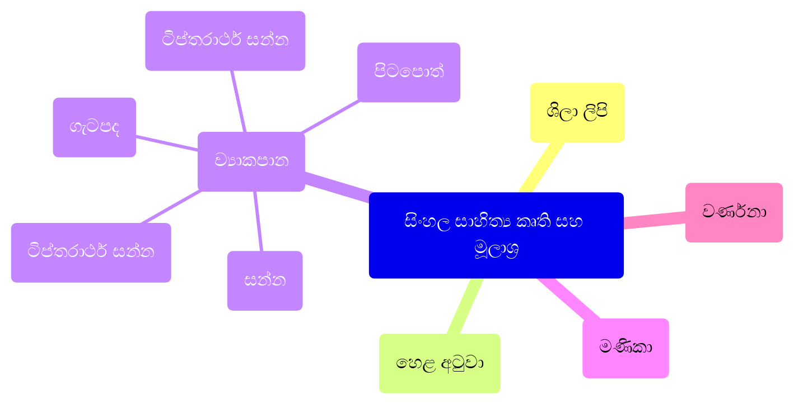

# සිංහල සාහිත්‍ය වංශකතාව

```mermaid
mindmap
    A(සිංහල සාහිත්‍ය කෘති සහ මූලාශ්‍ර)
        B(ශිලා ලිපි)
        C(හෙළ අටුවා)
        ::icon(fa fa-book)
        D(ව්‍යාකපාන)
            E(ගැටපද)
            F(පිටපොත්)
            H(ටිප්තරාර්ථ සන්න)
            H(ටිප්තරාර්ථ සන්න)
            I(සන්න)
        G(මණිකා)
        J(වර්ණනා)
```
